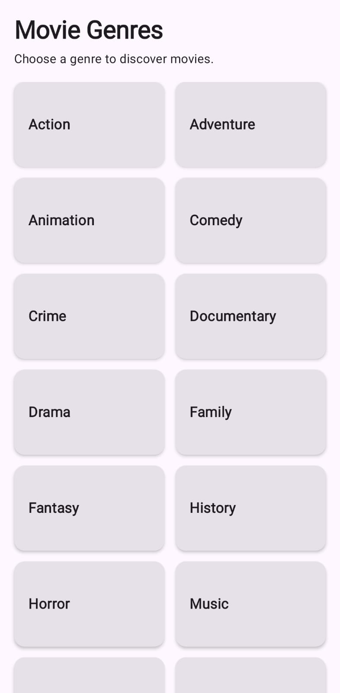
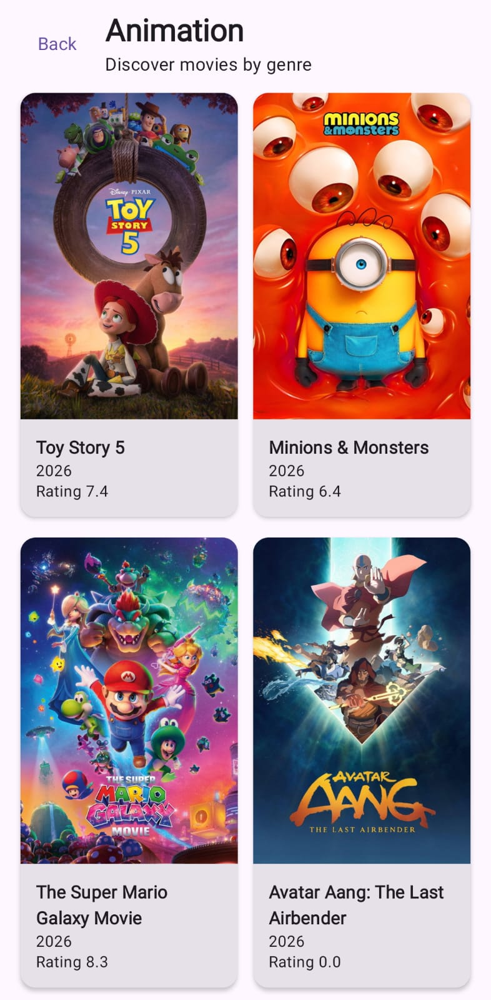
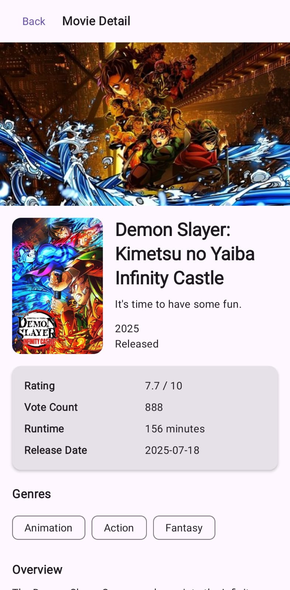
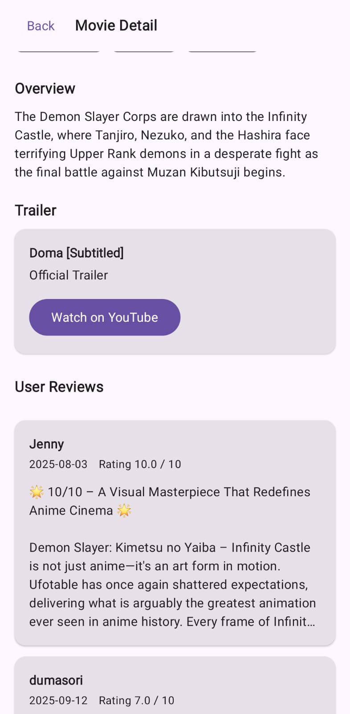
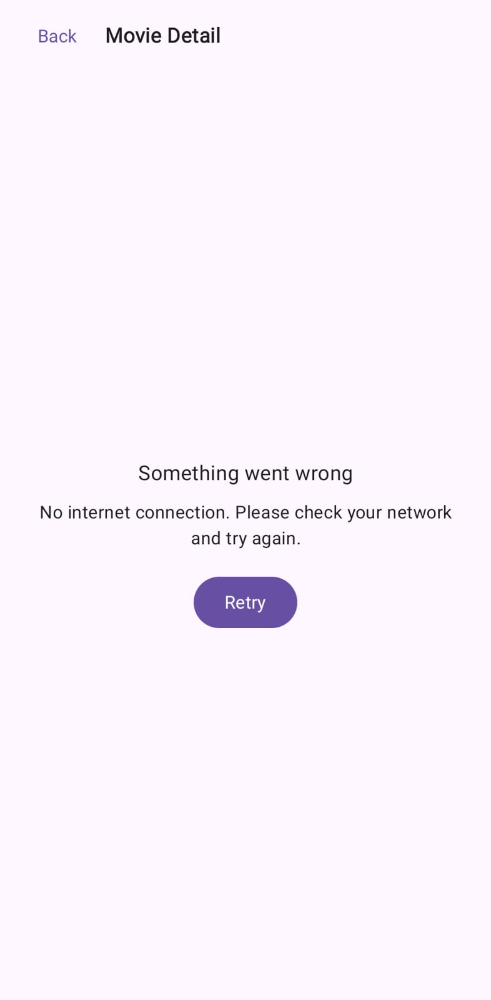

# Android Movie App TMDB

Native Android movie application built for Android Developer technical test.

This app uses TMDB API to display official movie genres, discover movies by selected genre, show movie detail, user reviews, and YouTube trailers.

## Features

- Display official movie genres
- Discover movies by selected genre
- Movie list with endless scrolling
- Movie detail screen
- Movie poster and backdrop image
- Movie rating, runtime, release date, vote count, status, genres, tagline, and overview
- YouTube trailer section
- Open trailer in YouTube or browser
- User reviews
- Reviews with endless scrolling
- Loading, empty, error, and retry states
- Missing poster and backdrop placeholder handling
- API token stored locally using `local.properties`

## Screenshots

### Movie Genres



### Discover Movies by Genre



### Movie Detail



### Trailer and Reviews



### Error State



## Tech Stack

- Kotlin
- Jetpack Compose
- Material 3
- Navigation Compose
- Type-safe navigation route
- Kotlin Serialization for navigation route
- MVVM
- Clean Architecture
- Repository Pattern
- Retrofit
- OkHttp
- Moshi
- Hilt
- KSP
- Paging 3
- Coil
- Coroutines
- Flow

## Architecture

This project uses a lightweight Clean Architecture approach.

```text
core/
  Common constants, UI state, and error mapper

data/
  Remote API, DTO, mapper, paging source, and repository implementation

domain/
  Domain models, repository contract, and use cases

presentation/
  UI screens, ViewModels, navigation, and reusable components

di/
  Hilt dependency injection modules
```

## Main Flow

```text
GenreScreen
    ↓
MovieListScreen by selected genre
    ↓
MovieDetailScreen
    ↓
Trailer + Reviews
```

## API Endpoints

This app uses TMDB API endpoints:

```text
GET /3/genre/movie/list
GET /3/discover/movie
GET /3/movie/{movie_id}
GET /3/movie/{movie_id}/reviews
GET /3/movie/{movie_id}/videos
```

## Project Structure

```text
app/src/main/java/com/deeromptech/androidmovieapptmdb/
├── MainActivity.kt
├── MovieApplication.kt
├── core/
│   └── common/
│       ├── Constants.kt
│       ├── ErrorMessageMapper.kt
│       └── UiState.kt
├── data/
│   ├── mapper/
│   │   ├── GenreMapper.kt
│   │   ├── MovieDetailMapper.kt
│   │   ├── MovieMapper.kt
│   │   ├── ReviewMapper.kt
│   │   └── VideoMapper.kt
│   ├── remote/
│   │   ├── api/
│   │   │   └── TmdbApi.kt
│   │   ├── dto/
│   │   │   ├── GenreDto.kt
│   │   │   ├── MovieDetailDto.kt
│   │   │   ├── MovieDto.kt
│   │   │   ├── PagedResponseDto.kt
│   │   │   ├── ReviewDto.kt
│   │   │   └── VideoDto.kt
│   │   └── paging/
│   │       ├── MoviePagingSource.kt
│   │       └── ReviewPagingSource.kt
│   └── repository/
│       └── MovieRepositoryImpl.kt
├── di/
│   ├── NetworkModule.kt
│   └── RepositoryModule.kt
├── domain/
│   ├── model/
│   │   ├── Genre.kt
│   │   ├── Movie.kt
│   │   ├── MovieDetail.kt
│   │   ├── Review.kt
│   │   └── Video.kt
│   ├── repository/
│   │   └── MovieRepository.kt
│   └── usecase/
│       ├── GetGenresUseCase.kt
│       ├── GetMovieDetailUseCase.kt
│       ├── GetMovieReviewsUseCase.kt
│       ├── GetMoviesByGenreUseCase.kt
│       └── GetMovieVideosUseCase.kt
└── presentation/
    ├── component/
    ├── genre/
    ├── movieList/
    ├── movieDetail/
    └── navigation/

## Setup

1. Clone this repository.

```bash
git clone https://github.com/tisnahadiana/android-movie-app-tmdb.git
```

2. Open the project in Android Studio.

3. Create a TMDB account.

4. Generate TMDB API Read Access Token.

5. Add your TMDB token to `local.properties`.

```properties
TMDB_ACCESS_TOKEN=your_tmdb_read_access_token_here
```

6. Make sure `local.properties` is not committed to GitHub.

7. Build and run the project.

For macOS/Linux:

```bash
./gradlew clean build
```

For Windows CMD:

```bat
.\gradlew clean build
```

## Positive Cases Covered

- Movie genres are loaded successfully
- User can select a genre
- Movies are displayed based on selected genre
- Movie list supports endless scrolling
- User can select a movie
- Movie detail is displayed
- Movie poster and backdrop are displayed when available
- Movie primary information is displayed
- YouTube trailer is displayed when available
- Trailer can be opened in YouTube or browser
- User reviews are displayed when available
- Reviews support endless scrolling

## Negative Cases Covered

- No internet connection
- Invalid or missing API token
- API/server error
- Empty trailer
- Empty reviews
- Missing poster image
- Missing backdrop image
- Movie list append loading
- Movie list append error with retry
- Reviews append loading
- Reviews append error with retry
- Retry action for failed requests

## Notes

This project is created for Android Developer technical test and evaluation purposes.

The TMDB API token is intentionally not included in this repository. Please add your own token in `local.properties`.
